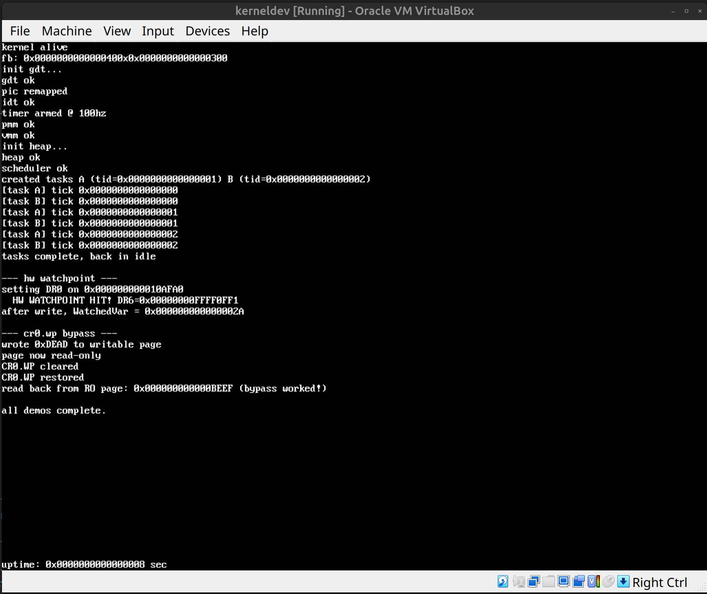
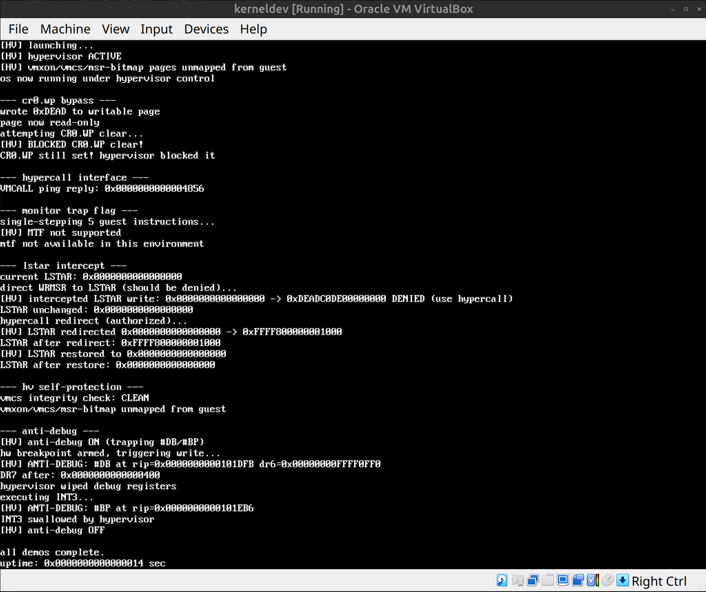

# kernel

Simple x86_64 operating system written from scratch in C and assembly. Boots via UEFI, no Linux kernel involved.



## OS Fundamentals

**Boot** — UEFI bootloader loads an ELF kernel from the ESP, grabs the memory map and framebuffer from GOP, exits boot services, jumps to ring 0.

**Display** — Framebuffer console with an 8x16 bitmap font for early text output.

**Interrupts** — GDT with TSS, full IDT, PIC remapping, PIT timer at 100hz.

**Memory** — Physical memory manager (bitmap allocator over the UEFI memory map), virtual memory manager with 4-level paging, identity mapped first 4GB using 2MB huge pages, higher half kernel mirror at `0xFFFF800000000000`. Kernel heap allocator (kmalloc/kfree/krealloc) built on the PMM.

**Scheduler** — Preemptive round-robin with kernel threads. Each task gets its own stack with a guard page. Context switch is 14 instructions of assembly saving/restoring callee-saved registers plus RSP.

## Low-Level Manipulation

**Hidden pages** — Allocate physical memory and remove all virtual mappings so the data is invisible to anything walking page tables.

**Split TLB** — Exploit the split between ITLB and DTLB to make the same virtual address return different physical pages depending on whether you read or execute.

**Hardware watchpoints** — DR0 through DR7 to trap on memory writes with zero overhead.

**CR0.WP bypass** — Clear write-protect in CR0 to write through read-only page table protections from ring 0.

## Hypervisor (Intel VT-x)



**Blue pill subversion** — The kernel launches itself into VMX non-root mode so the hypervisor runs transparently underneath.

**CR0/CR4 trapping** — VMCS guest-host masks prevent the kernel from disabling write protection, SMEP, or SMAP.

**MSR protection** — MSR bitmap intercepts writes to LSTAR, IA32_DEBUGCTL, and SYSENTER_EIP. Direct WRMSR is denied, authorized changes go through the hypercall interface.

**Hypercall interface** — VMCALL dispatch on RAX for kernel-to-hypervisor communication. Supports LSTAR redirect/restore, monitor trap flag, anti-debug toggle, and integrity queries.

**VMCS integrity** — Every VM exit verifies HOST_RIP, HOST_RSP, HOST_CR3, MSR bitmap address, CR masks, and execution controls against a known-good snapshot. Any tampering halts the system immediately.

**Self-protection** — VMXON, VMCS, and MSR bitmap physical pages are unmapped from the guest virtual address space after launch. Ring 0 cannot write to hypervisor structures through the identity mapping.

**Anti-debug** — Exception bitmap traps #DB and #BP at the VMX level before they reach the guest IDT. Hardware breakpoints are silently cleared, INT3 is swallowed. Debug registers can be set but exceptions never fire from the guest's perspective.

**EPT** — Extended page tables implemented with identity-mapped 2MB huge pages for the first 4GB. Currently disabled under VirtualBox due to nested VMX limitations. Untested on bare metal and KVM.

## Building

Requires `gcc`, `nasm`, `x86_64-w64-mingw32-gcc`, `mtools`, `dosfstools`, and `VBoxManage`.

```
bash build.sh run
```
